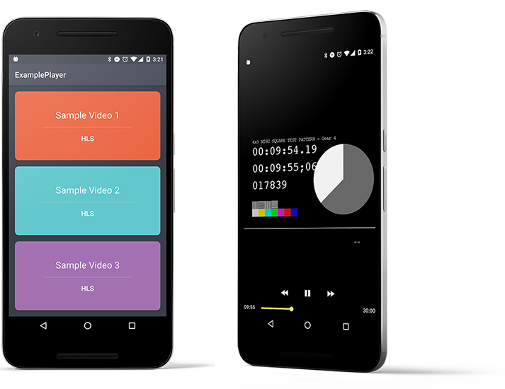

buzzfeed-devfest-conference-2016
======

A sample Android app which showcases Google's ExoPlayer library.

The ExoPlayer wrapper in this sample primarily demonstrates HLS adaptive video playback using a
TextureView.

Additional Resources
---------
 * Google's ExoPlayer Demo - http://github.com/google/ExoPlayer
 * Grafika (Experimental) - https://github.com/google/grafika

Libraries
---------
 * ExoPlayer (1.5.5) - http://github.com/google/ExoPlayer
 * ButterKnife - http://jakewharton.github.io/butterknife
 * Timber - http://github.com/JakeWharton/timber

Android Studio
--------------

 * If you do not have Android Studio installed, get it here -- http://developer.android.com/sdk/index.html.
 * This project requires APK level 23.
 * Android Studio is quite good at suggesting solutions for missing SDKs and Plugins.
 * Go to   Android Studio's pulldown for Tools -> Android -> SDK Manager, then select Launch Stand Alone SDK Manager.

